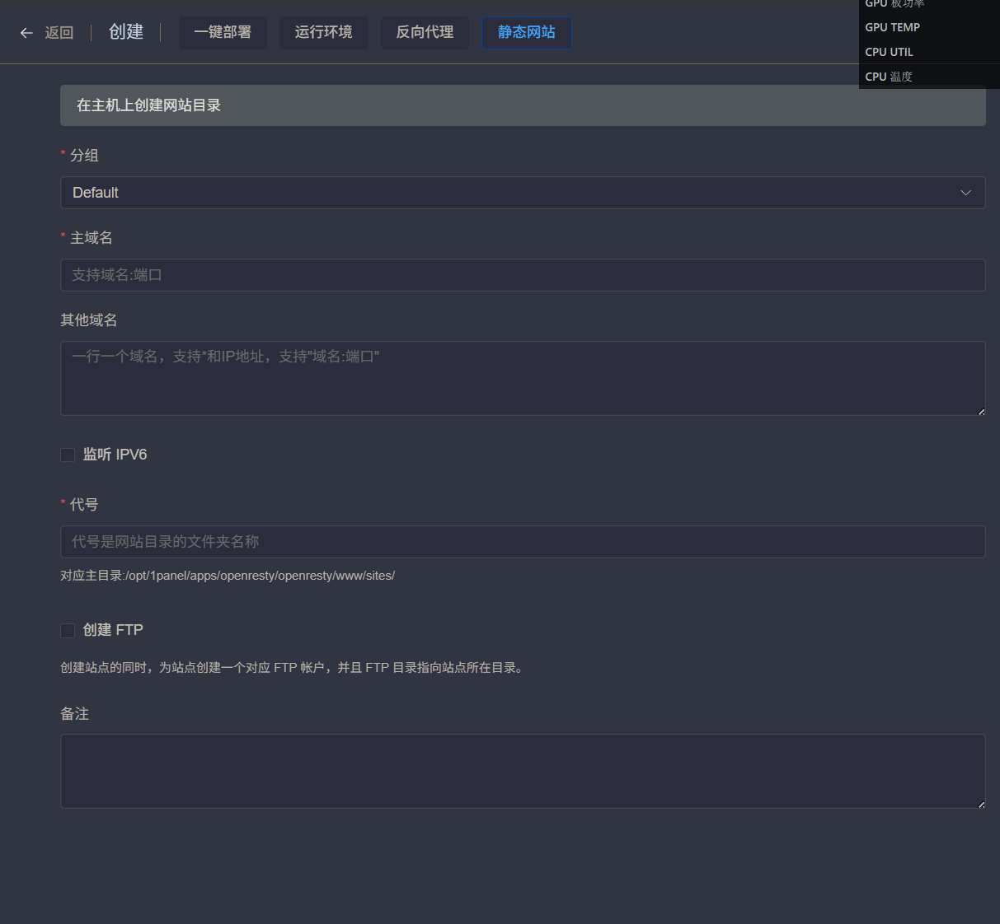
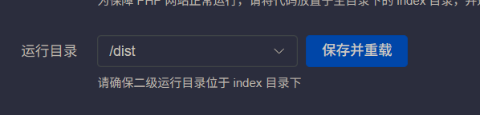
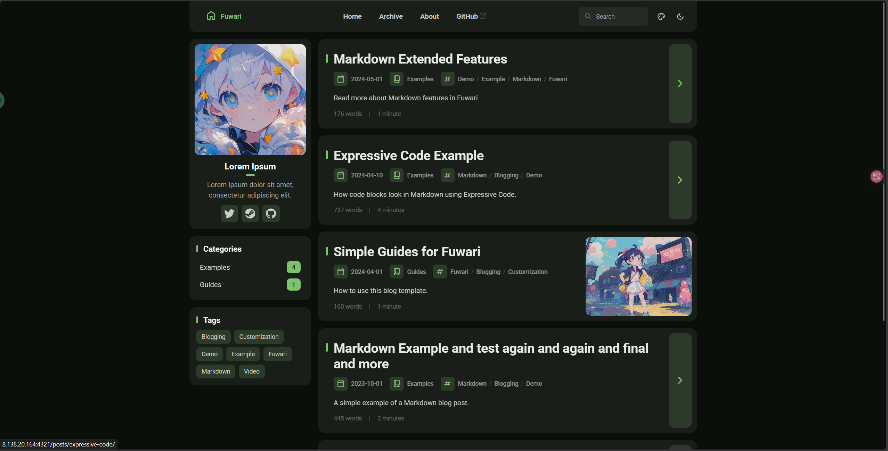
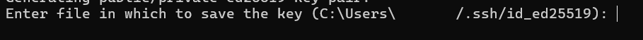
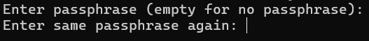
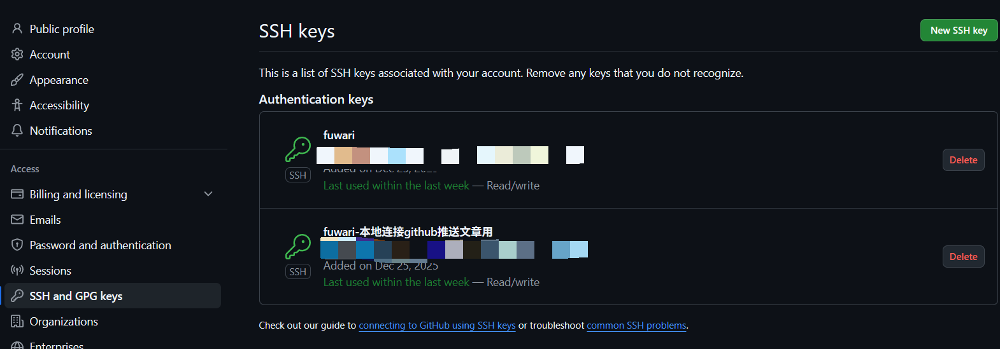
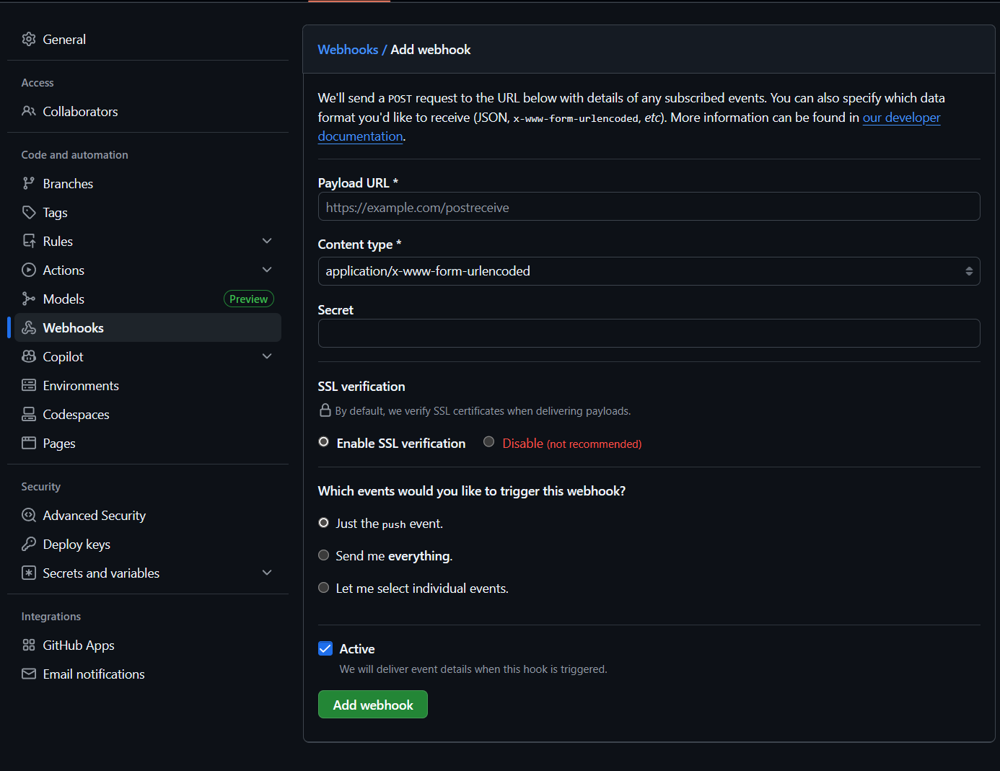

---
tags:
  - Fuwari
  - 1panel
title: 如何在安装了1Panel的云服务器上部署Fuwari
published: 2025-12-26
category: 教程
---
>*个人所用的服务器是阿里云服务器,其他服务商的服务器可能存在些许出入*

前几天也是在b站上看见了up主二叉树树的视频,我对于他的博客界面十分好奇是怎么做出来的,经过搜索之后发现这个框架叫Fuwari.我一看,哇这个框架这么好看,我要用我要用!于是就把服务器上本来运行着的mysql和holo关了准备搞fuwari.

兴致满满的去搜教程,结果一搜到发现:吔?你怎么是个静态网页,什么?你居然不在1panel的应用市场里!这下看不懂了.只好去b站等搜索引擎去搜索教程,结果教程本身又少,有的大多数也是教的怎么通过 Github 和 Cloudflare (*我是不是拼错了*)来实现免费的博客搭建.可是不行啊!这样的话我的服务器不是白买了!(*这家伙在说什么呢*)  

于是我只好一个人和我们的Gemini老师探讨起了怎么在1panel面板的服务器上部署Fuwari.  
一开始,gemini建议我跟1panel的逻辑一样,选择把Fuwari部署到一个容器里,但是由于本人对docker可以说是一窍不通,而且gemini也没有给出一个对这个docker可用的重新构建网站的方法,所以最后放弃了这个方案.  

后面找到了Up主 二叉树树的的教程[Up主 二叉树树的的教程](https://www.bilibili.com/video/BV148JJzAEK9/),在更深入的思考后,我确立了自己的Fuwari部署的目标:
- 成功部署(~~废话~~)
- 通过在电脑和手机上编写markdown格式的文章推送到github或者服务器本地
- 服务器从github上自动拉取更新的文章后重新构建网站

最终我是选择了推送到github,对于我选择的Obsidian编辑器来说,推送到github上似乎更简单一些(有现成插件),那么我们开始来分点完成目标:

## 1.成功部署

第一步肯定是 fork 或者 generated Fuwari的库,这个不用教学了吧

Docker方式被我放弃后,我选择直接在1panel上部署静态网页,但是,当我部署完Fuwari和nodejs后,发现1panel居然不支持**先射箭后设靶**!

这是什么意思呢?比如说,我现在在/opt/fuwari下clone了Fuwari的仓库,并且建站完成,前往1panel的面板进行建立网站...

对,它不支持指定网站的目录,他必须先建立一个镜像网站之后再在他创建的目录里clone项目然后进行建站.

那么,在创立网站之后,/fuwari/index文件夹下,我们在进行clone后要把clone出来的项目从/index/fuwari中全部移出  
移出到/index目录下,然后进行建站.  

同时因为nodejs进行build之后生成的网站实际内容是在/dist目录下的,所以需要去面板的网页设置处把运行目录设置为/dist
在/index目录下打开终端,运行``npm install``和``npm build``后,等待一定时间让网站建立.最后访问你设置的地址,就能看见Fuwari的默认样式界面了
<p align="center" style="font-size: 1em; color: gray;"><sub>大概是这个样子,颜色和文章标题应该会和我有所不同</sub></p>

## 2.  从本地推送

服务器上部署好了,但是我们怎么给这个博客上传文章呢?有两种方法,
1. 直接给服务器上传你写好的markdown文件 
2. 给github上你的仓库上传你的markdown文件
我选择的是第二种,这样虽然对于我服务器的优势展现不明显,但是github胜在有完善的拉取上传机制和优秀的文件历史更改的查询功能.

那么,和第一步类似,你要先在本地的任意一个文件夹里clone你的仓库,然后你的设备上创建一对密匙,他们就像一个锁和对应的钥匙,你的设备持有钥匙,再把锁上传到github,就能让设备和github建立ssh连接.

假设你的设备是windows,那么打开`powershell`,运行以下命令:
```powershell
ssh-keygen -t ed25519 -C "your_email@example.com"
```
`-t`是协议 这个不用动  
`-C`可以认为是一种注释,里面你想填什么填什么,只是为了你方便辨认,没有这个项也是可以的

输入之后,如图:
你可以输入你指定要输出密钥的路径,也可以默认,接下来会:
这个是问你你要不要给密钥再加一个独立密码&确认一次你输入的密码,不想填可以直接全部enter.
创建完成之后,找到你的两个密钥文件,他们其中一个会有.pub后缀.这个就是"锁",没有后缀那个则是"钥匙".接下来,打开github,进入你的账户设置:
点击右上角的`New SSH Key`,名称随便填,key type默认,然后把.pub后缀的文件内容输入进去,点击确认,key就设置好了.此时可以在克隆仓库的根目录(/fuwari 文件夹里)运行下方命令来验证连接:
``` powershell
ssh -T git@github.com
```

如果结果是`Hi 用户名! You've successfully authenticated`,则说明成功连接.如果显示令牌不对,则可能是终端没有用你创建的钥匙去访问github,可以尝试运行`Powershell`,输入以下命令来尝试修复:
``` powershell
Set-Service ssh-agent -StartupType Automatic
Start-Service ssh-agent
#Home这里改成你的密钥存放的地方
ssh-add $HOME\.ssh\id_ed25519
git config --global core.sshCommand "C:/Windows/System32/OpenSSH/ssh.exe"
```
<p align="center" style="font-size: 1em; color: gray;"><sub>这串命令会让windows 的ssh服务使用你指定的密钥,并让git使用windows的ssh服务</sub></p>
有了钥匙和锁,我们也需要一双手去使用这个钥匙.我们固然可以在根目录里每次写完文章后运行命令来手动提交,但是我使用了Obsidian来进行文章的编写和github的上传.

安装和配置Obsidian的教程可以参考Up主二叉树树的视频:  

>[拳打Typora，脚踢MarkText，论黑曜石为什么是MarkDown编辑器的神！_哔哩哔哩_bilibili](https://www.bilibili.com/video/BV1C7pDzpEHY/)

在Obsidian的扩展市场里安装Git插件,然后在任何终端执行以下命令:
```powershell
git config --global user.name "你的GitHub用户名"
git config --global user.email "你的注册邮箱"
```
来让Obsidian向github推送更新时知道往哪里推送.配置好之后,写完文章后,只需要按下ctrl+p,运行`Obsidian Git: Commit-and-sync`,就能把本地的文章给提交到github仓库上.

## 3.服务器的自动拉取和构建
看完前两步,服务器本地部署了仓库,本地写的文章可以方便的传到github仓库里,剩下的问题就很清楚了:怎么让服务器自动检测到github的仓库内容更新了,然后自动从仓库上拉取更新,然后自动把页面再构建一遍.

我们大概的解决思路是:
1. github仓库通过本地上传更新仓库后,向服务器发送一个请求
2. 服务器接收到请求
3. 服务器拉取仓库,更新文章
4. 服务器重新构建网站

这里我们会用到一个脚本,来自Up主二叉树树的视频:

>[你的服务器也可以做自动构建？_哔哩哔哩_bilibili](https://www.bilibili.com/video/BV148JJzAEK9/) 

里提供的脚本:

>[afoim/vps-cicd: 简易的VPS CI/CD](https://github.com/afoim/vps-cicd)

先把这个项目里的`app.py`下载到服务器上.这个.py的功能是运行时检测github有没有通过webhook发送请求,当检测到请求的时候就执行一个脚本,这个脚本需要我们自己写.下载完成后,我们先按下不表.

来到github上你的仓库界面,打开setting,点开webhook,新建webhook,界面如下:
URL填写:  
`你的服务器的公网IP:一个空闲端口`   
比如:  
`1.2.3.4:6657`  
Type不用动;  
secret则是一种类似密码的东西,可以填写也可以不填写,填写了的话要记下,后面有用;  
SSL这里选择Disable;  
下面选择默认的Just the Push.  
设置完成后点击`Add webhook`,管它github能不能检测到服务器呢直接跑路(其实是github的检测似乎有点问题,就算是通的他也显示无法连接,~~但是如果你的服务器真的通不了的话他也显示通不了就是了~~)

OK,现在回到服务器,把`app.py`解压到一个文件夹下,再创立一个文件`build.sh`,里面输入:
``` bash
#打开你的网站里index的目录
cd /opt/1panel/apps/openresty/openresty/www/sites/fuwari/index
#从github仓库里获取内容更新
git pull
#安装可能存在的更新
pnpm install
#构建网站
pnpm build
```

这就是上面提到的`app.py`检测到github发送的请求后会执行的脚本,功能如代码里所写.那么,接下来我们打开服务器的终端,新建一个叫`autobuild`的屏幕:

```bash
screen -S autobuild
```

如果显示没有这个命令的话,可能你需要先安装screen:

``` bash
# 如果是 Alibaba Cloud Linux / CentOS 
yum install screen -y 
# 如果是 Ubuntu / Debian 
apt update && apt install screen -y
```

现在我们创建了一个屏幕,在这里运行的程序就算我们断开了终端的连接,也依然会继续运行,这样我们就可以让`app.py`在后台一直运行.  
在这个screeen里运行:
```python
#-key后面的字符串就是你前面在webhook设置的secret字符串
#-l后面的端口就是你你在webhook设置的端口
python3 app.py -key your_webhook_secret -l 0.0.0.0:6657
```
就可以在后台一直运行这个py文件了,当程序检测到github的请求,就会自动从github拉取更新然后自动重建网站,整个服务的环就接上了.